## KEYCLOAK SETUP

#### END POINT:
```shell
http://localhost:8281/  (admin, admin)
```

Create new Realm: _LiteMesh_
<div align="center">
<a href="assets/keycloak/create_new_realm.png"> 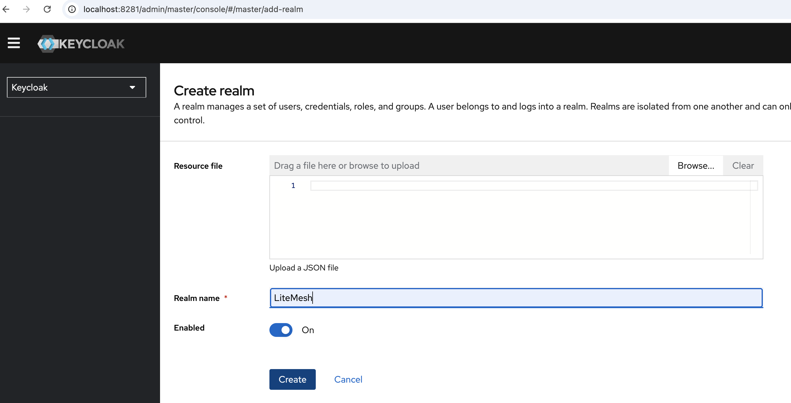</a>
</div>


Create a New Client: _lite-mesh-gateway-client_
<div align="center">
<a href="assets/keycloak/create_new_client_settings_1.png"> 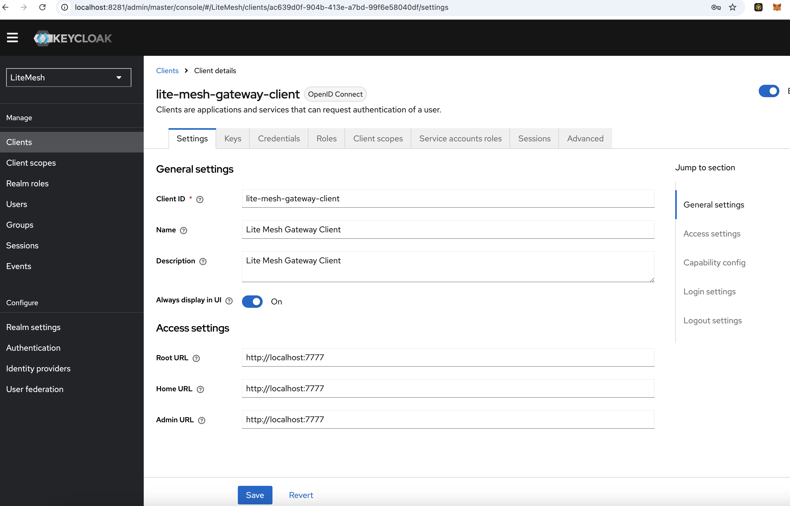</a>
<a href="assets/keycloak/create_new_client_settings_2.png"> 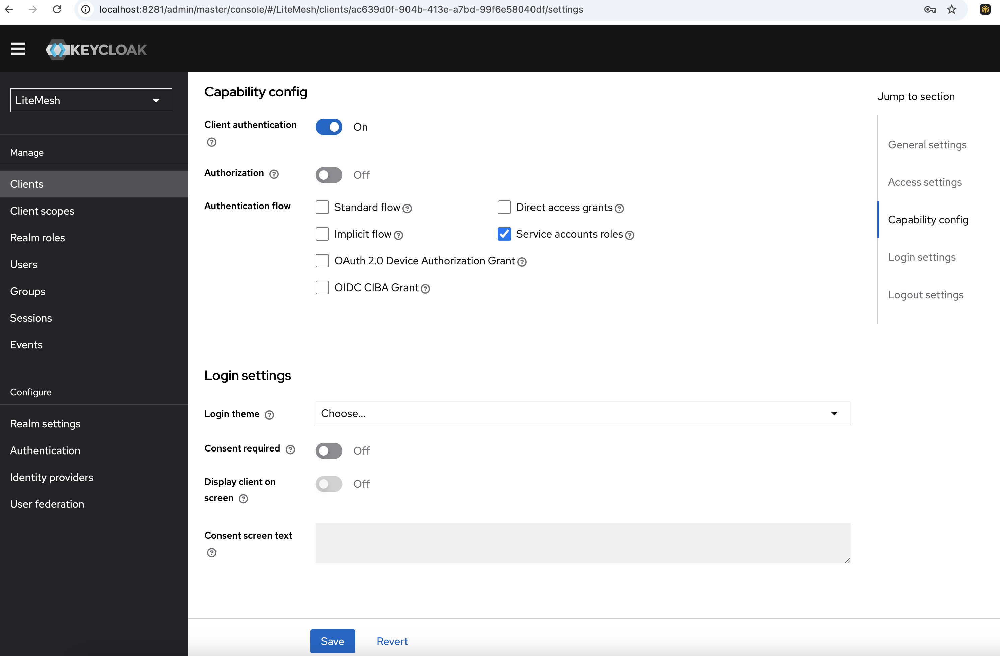</a>
<a href="assets/keycloak/create_new_client_settings_3.png"> 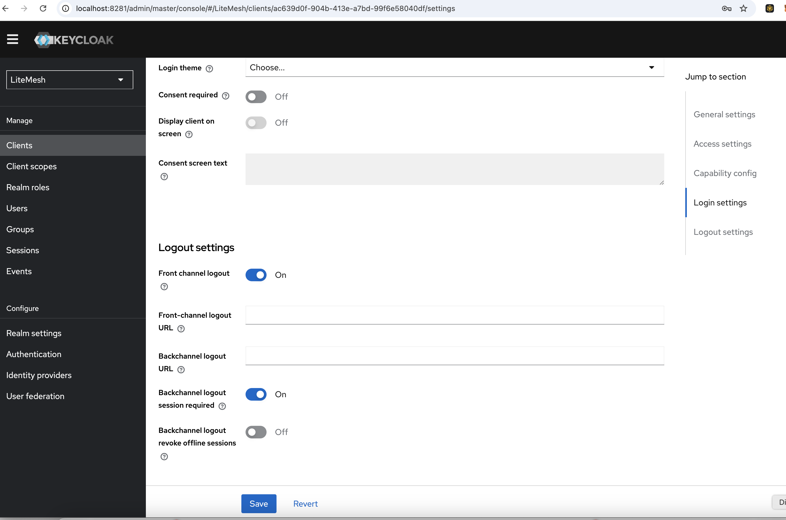</a>
</div>

Create Client Role: _gateway_admin_
<div align="center">
<a href="assets/keycloak/create_new_client_role.png"> 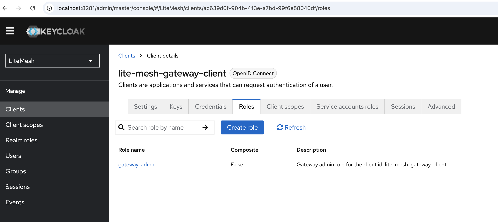</a>
</div>

Create Realm Role: _gateway_admin_realm_
<div align="center">
<a href="assets/keycloak/create_new_realm_role.png"> 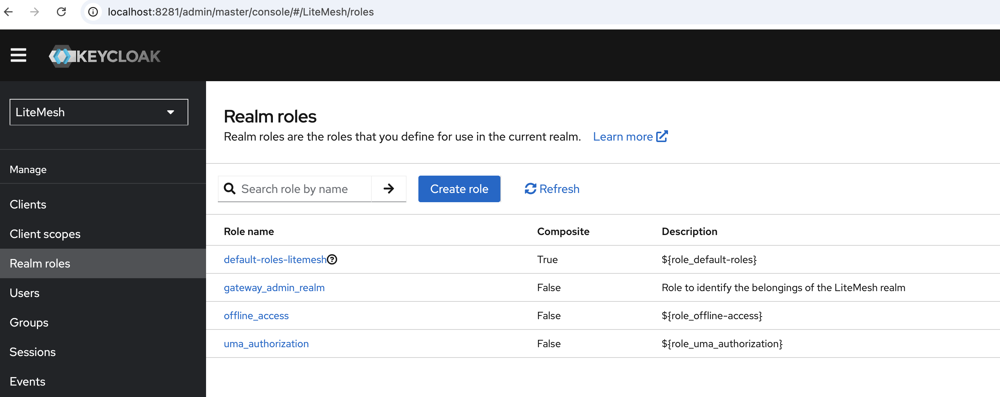</a>
</div>

Assign Service Account Roles: _gateway-admin_ and _gateway-admin-realm_
(Make sure to "Filter by client" role and then "Filter by realm roles" to select the respective roles)
<div align="center">
<a href="assets/keycloak/assign_service_account_roles.png"> 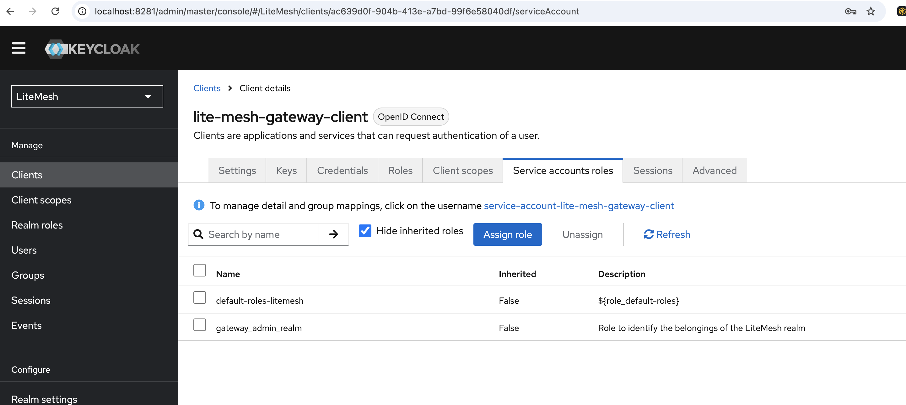</a>
</div>

Create new Client Scope: _gateway.read_
<div align="center">
<a href="assets/keycloak/create_client_scope.png"> 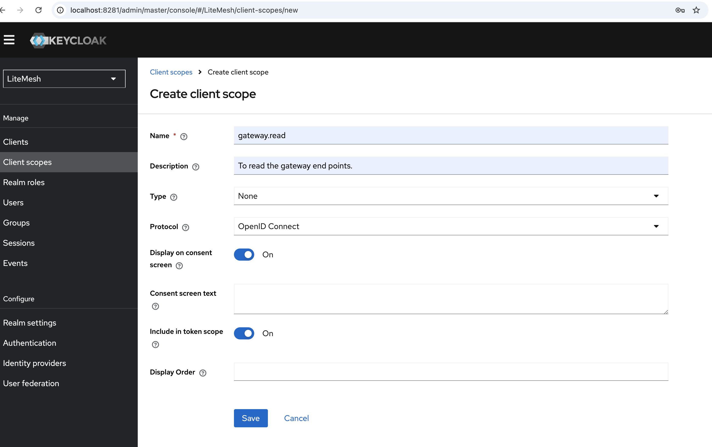</a>
</div>

Assign scope roles for gateway.read; _gateway-admin_ and _gateway-admin-realm_
(Make sure to "Filter by client" role and then "Filter by realm roles" to select the respective roles)
<div align="center">
<a href="assets/keycloak/assign_scope_roles.png"> </a>
</div>

Finally, add client scope "gateway.read" to the client "lite-mesh-gateway-client" as Default
<div align="center">
<a href="assets/keycloak/add_client_scope_to_the_client.png"> 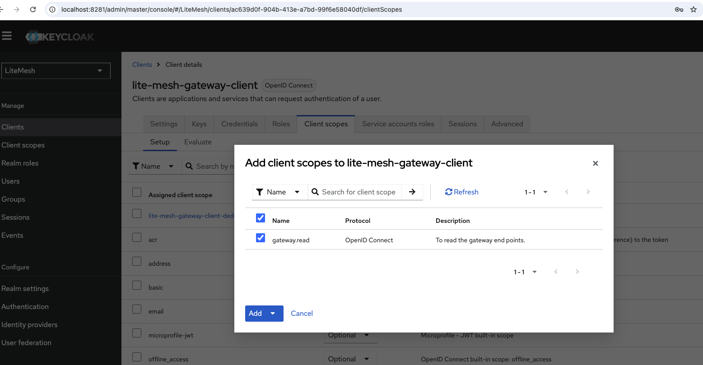</a>
</div>

Make sure to add the frontend-url
<div align="center">
<a href="assets/keycloak/frontend-url.png"> 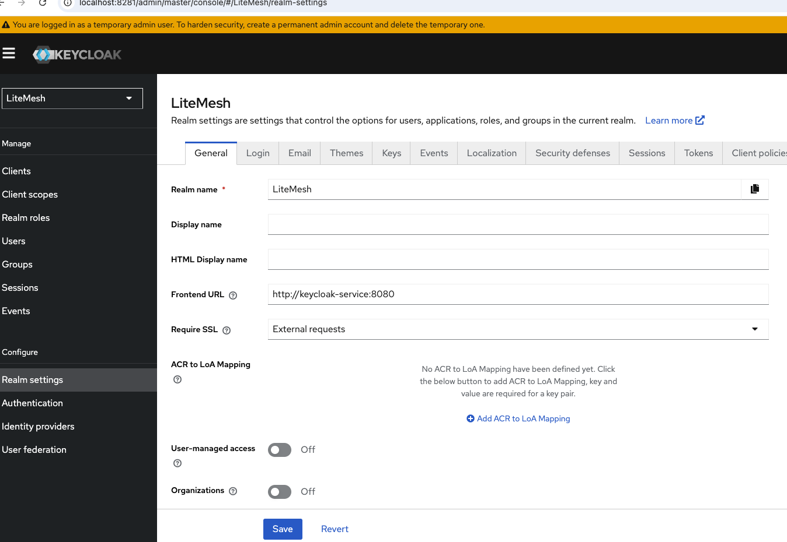</a>
</div>

## CLIENT SECRET
Don't forget to copy-paste the Client Secret from Credentials to your Postman or Application
<div align="center">
<a href="assets/keycloak/client_secret.png"> 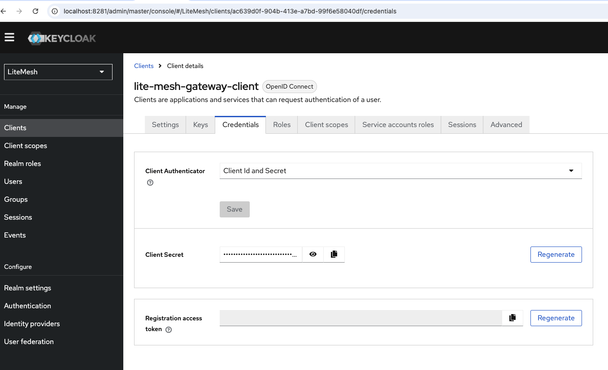</a>
</div>


Don't forget to update the client secret inside api-gateway application.yml file:
(2 places)
```shell
client-secret: chFLPrOnco5yvNdLsdmH0itOzavuUYqz
```

## ADDING CLIENT SCOPES
Let's add inventory-service an product-service scopes

### inventory-service.read
<div align="center">
<a href="assets/keycloak/inventory-service.read.png"> 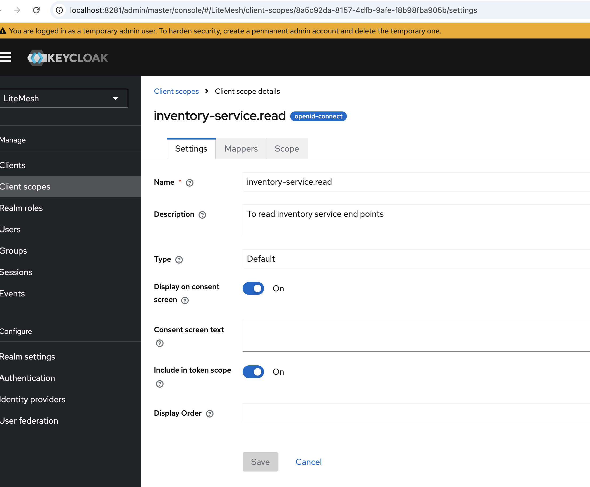</a>
</div>

### product-service.read
<div align="center">
<a href="assets/keycloak/product-service.read.png"> 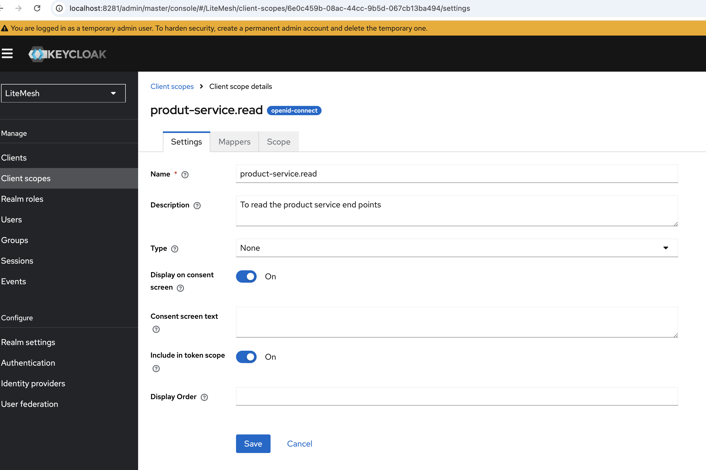</a>
</div>

You should see both of the scopes below; inventory-service an product-service
<div align="center">
<a href="assets/keycloak/client_scopes.png"> 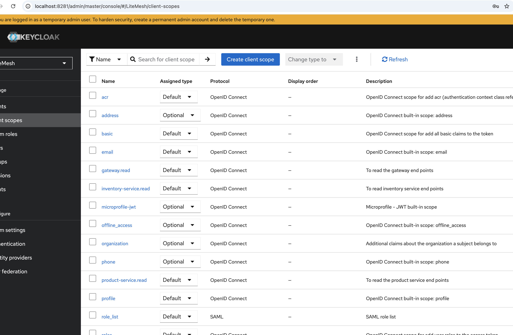</a>
</div>

Now assign them to the open-id lite-mesh-gateway-client client scopes
<div align="center">
<a href="assets/keycloak/add_to_client_scope.png">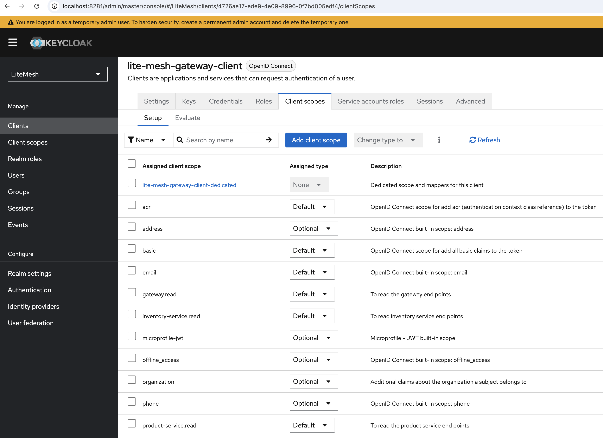 </a>
</div>

## VALIDATE ACCESS TOKEN
Let's generate the token in Postman (as we mentioned client secret varies in your own keycloak)

- POST: http://localhost:8281/realms/LiteMesh/protocol/openid-connect/token
- grant_type: client_credentials
- client_id: lite-mesh-gateway-client
- client_secret: chFLPrOnco5yvNdLsdmH0itOzavuUYqz
- scope: gateway.read

<div align="center">
<a href="assets/keycloak/access_token.png"> 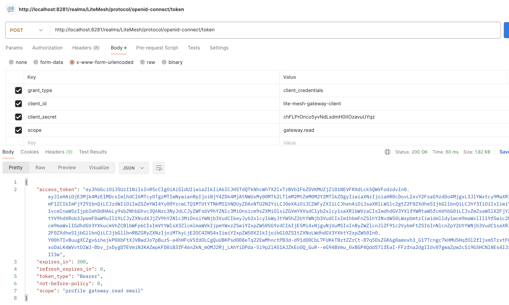</a>
</div>


