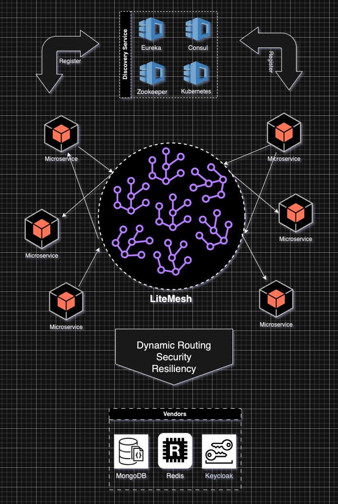
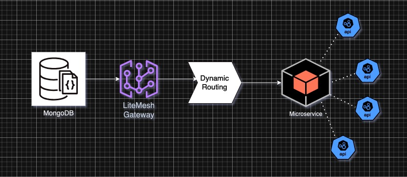
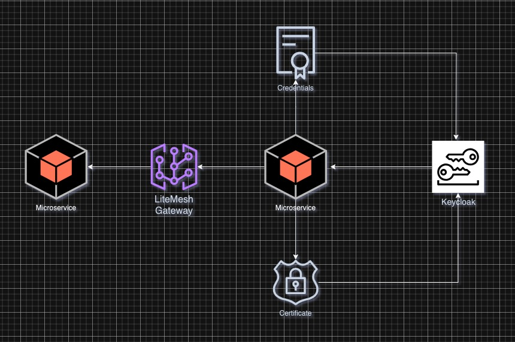

**<h1>What is LiteMesh?</h1>**
LiteMesh is designed as a lightweight, highly adaptable API gateway that addresses the challenges of dynamic routing, 
security, and resilience with simplicity and speed.

While other competitors offer complex and heavyweight solutions, 
LiteMesh provides a lean, developer-friendly platform that can grow to meet the demands of modern microservices and 
serverless architectures—positioning itself to become a leading solution as the API ecosystem evolves.

## DYNAMIC ROUTING
We chose dynamic routing because of its ability to handle the challenges of modern API management systems, especially 
in environments where APIs are deployed across different regions, dynamically scaling, or continuously evolving. 

It ensures high availability, low latency, and real-time adaptation, which are key for businesses seeking agility in 
their API ecosystems. With dynamic routing, LiteMesh can easily support cloud-native architectures, microservices, and 
multi-region deployments, providing our users with a robust, future-proof solution. 

Dynamic routing offers several benefits, especially in modern distributed systems, microservices architectures, and API gateways like LiteMesh. Here’s why it’s crucial and how it works:

### Benefits of Dynamic Routing:

1. **Flexibility and Adaptability:**
    `` 
    Dynamic routing allows the system to automatically adjust routes based on changing network conditions, traffic loads, or server availability. This ensures optimal performance and minimal downtime, even as services evolve. 
    ``

2. **Real-Time Traffic Management:**
   ``
   With dynamic routing, traffic can be rerouted in real-time based on load, server health, or geographic proximity. This leads to better resource utilization, reduced latency, and improved user experiences.
   ``

3. **Scalability**
   ``
   As services scale up or down, dynamic routing can accommodate new instances or remove dead ones without requiring manual intervention. This is especially valuable in cloud environments where servers are added or removed dynamically.
   ``

4. **Centralized API Management:**
   ``
   Dynamic routing allows you to manage and adjust routing rules centrally without making changes to individual services or requiring them to restart. This simplifies the management of complex microservice architectures.
   ``

5. **Reduced Configuration Overhead:**
   ``
   With static routing, you need to manually update configurations when services or endpoints change. Dynamic routing eliminates this overhead by automatically adjusting to service changes.
   ``

## SECURITY

In an API gateway like LiteMesh, security is critical for safeguarding sensitive data, preventing unauthorized access, 
and ensuring compliance with privacy and security regulations. 

The gateway serves as a central point for managing and securing communication between clients and backend services, 
making it the front-line for security enforcement. By securing both external access (Client-to-Gateway) and internal 
communication (Gateway-to-Service), LiteMesh ensures that the entire data flow is protected from potential breaches or 
unauthorized access.

<h3>Overall Benefits of This Dual-Layer Security Model</h3>

### Separation of Concerns:
- This dual-layer approach simplifies the architecture by keeping authentication/authorization concerns separate from 
service communication, allowing each layer to focus on its specific security functions.

### Zero-Trust Architecture:
- LiteMesh's approach to security embodies a zero-trust model, where no entity (client or service) is trusted by default, 
and every interaction must be authenticated and authorized.

### Flexible and Scalable Security:
- Using OAuth2 and JWT allows LiteMesh to handle millions of API requests, while mTLS ensures that all internal 
communications are locked down tightly. This makes the platform secure at scale.

### Reduced Attack Surface:
- By validating tokens at the gateway and enforcing mTLS for internal communication, LiteMesh reduces the attack 
surface, making it harder for attackers to breach or compromise any part of the system.

In summary, the client-to-gateway security ensures that only trusted clients with valid credentials can access the APIs,
while the gateway-to-service security guarantees secure and trusted communication within the system.
This holistic approach creates a robust, secure API management platform, protecting both external and internal 
interactions across the microservices architecture.

## RESILIENCY
