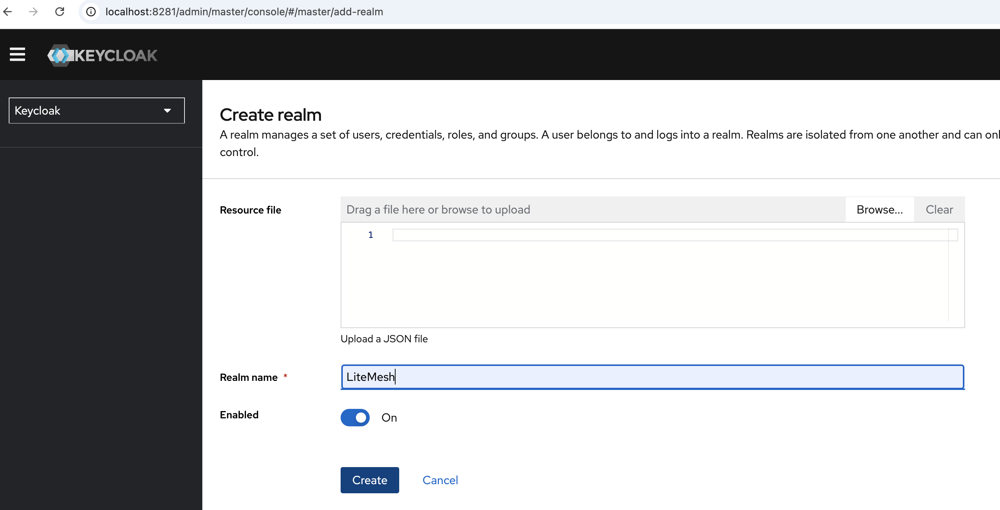
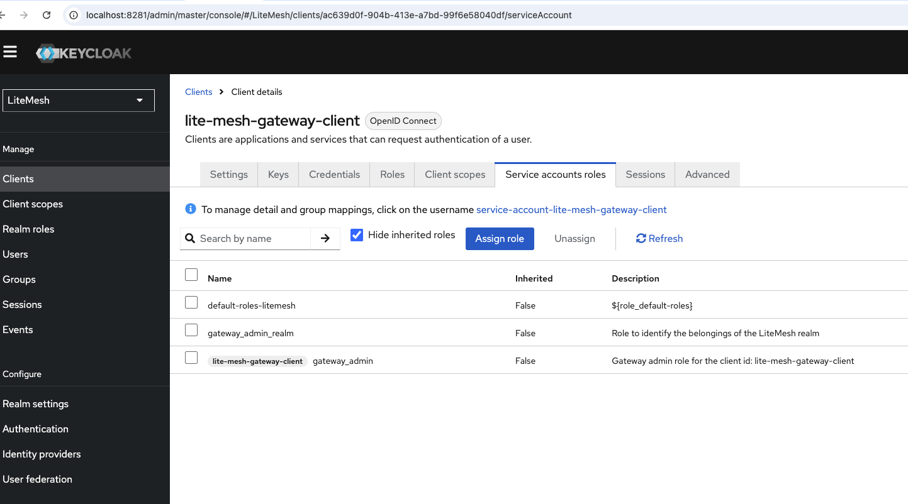
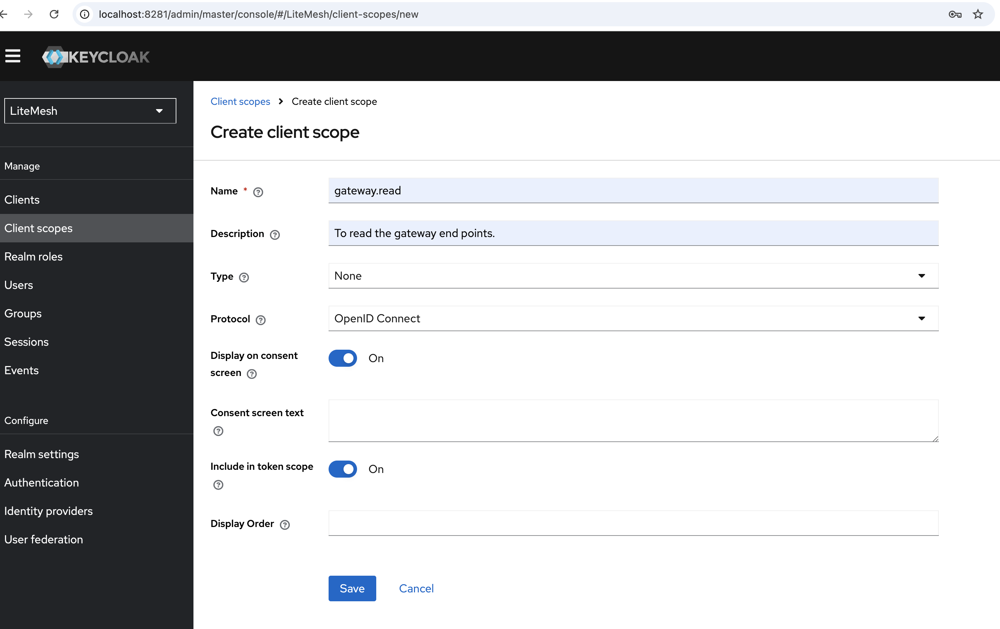
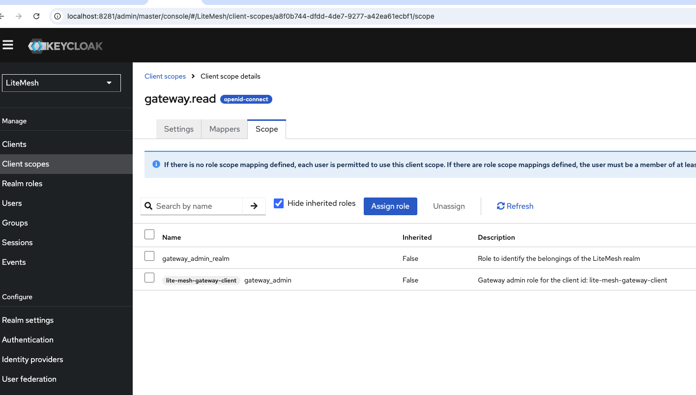
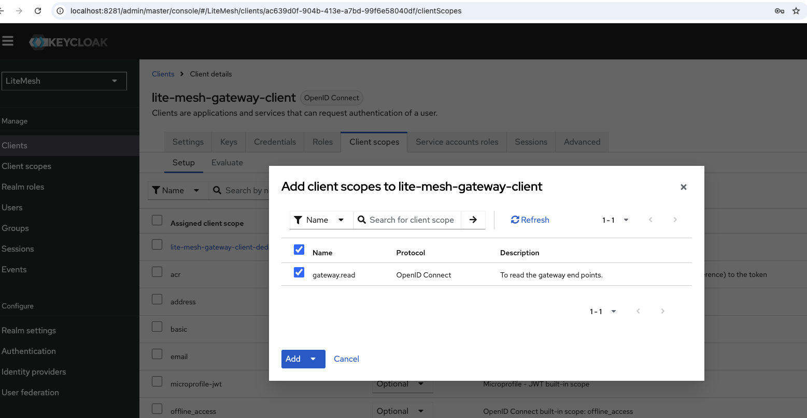
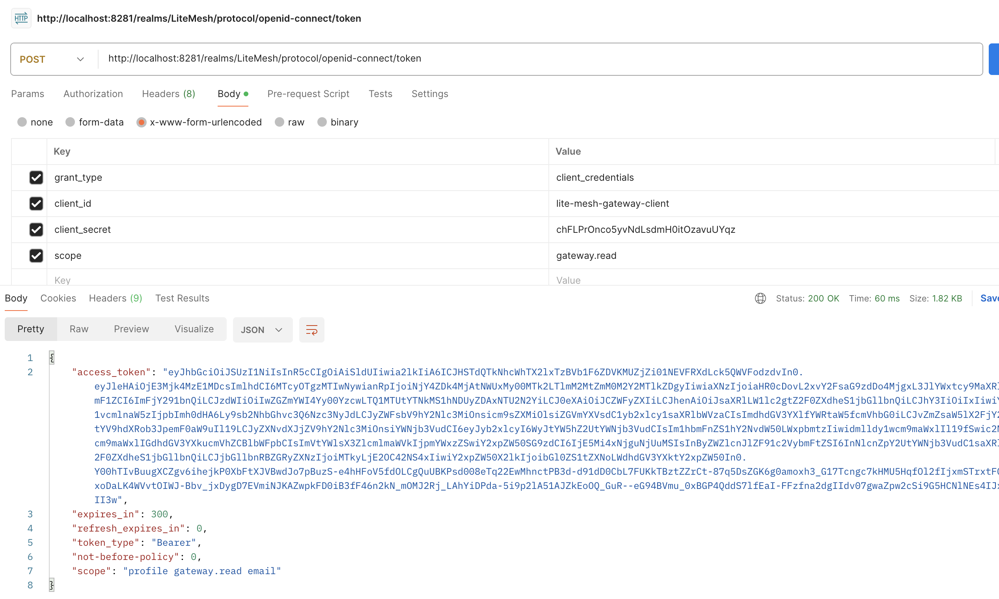
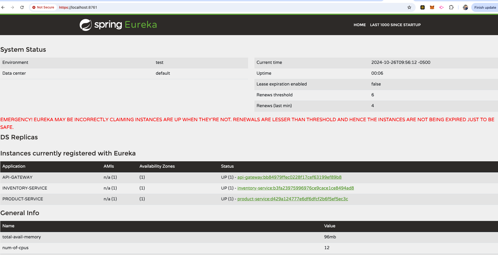
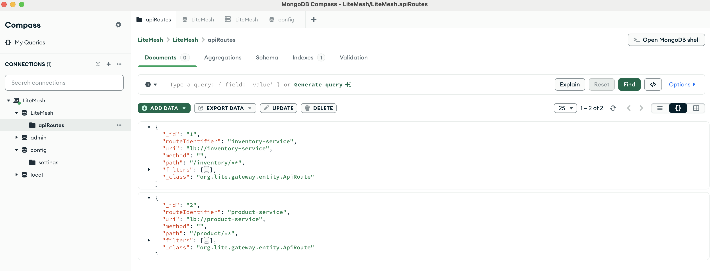

  


# What is LiteMesh
LiteMesh is a lightweight, highly adaptable API gateway built to streamline the complexities of dynamic routing, 
security, and resilience, all with an emphasis on simplicity and speed. Designed for developers and Site Reliability 
Engineers (SREs), LiteMesh is a tool that teams can download, build, and deploy quickly to support microservices or 
serverless architectures.

While many competing solutions are heavyweight and complex, LiteMesh focuses on a developer-friendly experience, 
offering a lean framework that integrates seamlessly with existing workflows. By providing essential functionality 
without the overhead, LiteMesh allows teams to efficiently manage traffic, enforce security protocols, and achieve 
robust service resilience.

Whether used as a standalone gateway or as part of a larger infrastructure, LiteMesh is positioned to grow alongside 
evolving API ecosystems, making it a practical choice for both current needs and future demands in scalable microservice 
environments.

# SERVICES

| Service               | Description                                                                                                      |
|-----------------------|------------------------------------------------------------------------------------------------------------------|
| **discovery-server**  | A Eureka server responsible for service discovery, enabling routing by dynamically resolving service addresses.  |
| **api-gateway**       | The central hub of the API ecosystem, managing all request flows with dynamic routing and built-in resilience.   |
| **inventory-service** | A sample microservice that demonstrates API integration within the ecosystem.                                    |
| **product-service**   | Another sample microservice with API integration, showcasing service communication.                              |
| **mesh-service**      | A user interface that will display metrics and statistics in detail (currently under development).               |


# HOW IT WORKS
LiteMesh operates at the center of the API ecosystem, serving as the primary gateway for all microservices communication.
Instead of allowing direct interactions between services, LiteMesh channels all requests through the gateway, creating
a streamlined workflow that reduces potential conflicts and enhances security.

LiteMesh serves as the core of the entire API architecture, acting as the dynamic gateway for all microservices communication.
It ensures that microservices interact through the gateway, preventing direct service-to-service communication and
improving security and manageability.

Dynamic routing allows LiteMesh to route requests efficiently based on service discovery, load balancing, and
application-specific rules. Both the gateway and microservices register themselves with the Service Discovery component,
enabling seamless discovery and routing based on service names, while also supporting load balancing across instances.

Security is enforced on two fronts: Client-to-Gateway security, using JWT validation with OAuth2 through an identity
provider (e.g., Keycloak), and Gateway-to-Service security through mTLS (Mutual TLS), ensuring a secure and encrypted
channel between services.

LiteMesh also supports comprehensive resiliency mechanisms, including:

- RedisRateLimiter
  ``
  which uses Redis to manage temporary rate-limiting data, even in distributed systems, controlling traffic and protecting services from overload.
  ``

- TimeLimiter,
  ``
  which prevents long-running requests by enforcing a timeout for each API call.
  ``

- CircuitBreaker
  ``
  which opens after detecting a failure threshold, preventing repeated failures from overwhelming services.
  ``

- Retry
  ``
  which retries failed calls a set number of times before giving up, improving reliability.
  ``

All these configurations—routing, security, and resiliency—are dynamically managed and stored in MongoDB, allowing
LiteMesh to adapt in real-time and protect APIs from attacks, overload, and vulnerabilities.

See below for the high level of LiteMesh architecture:

<div align="center">
<a href="assets/LiteMesh.jpg"> </a>
</div>


# PREREQUISITES

## ENVIRONMENTAL VARIABLES
SSL key file generation will be covered in a later section, but keys have already been provided for running the applications locally.

To set the necessary environment variables, open your profile configuration:
```shell
nano ~/.zshrc
```

Below are the environment variables needed for Java, Maven, and SSL keystore paths. Be sure to adjust the paths to 
match the location of your ``` .jks ``` files, which are stored in the "keys" folder by default. However, you can choose an 
alternative location for your keys if preferred.

```editorconfig
# Java and Maven
export JAVA_HOME=$(/usr/libexec/java_home -v 21)
export PATH=$JAVA_HOME/bin:$PATH
export M2_HOME="/Applications/IntelliJ IDEA CE.app/Contents/plugins/maven/lib/maven3"
export PATH="$M2_HOME/bin:$PATH"

# SSL environmental variables for Eureka Discovery Server
export EUREKA_KEY_STORE="/Users/mehmetsen/IdeaProjects/LiteMeshApp/keys/eureka-keystore.jks"
export EUREKA_KEY_STORE_PASSWORD="123456"

# SSL environmental variables for API GatewayAPI Gateway
export GATEWAY_KEY_STORE="/Users/mehmetsen/IdeaProjects/LiteMeshApp/keys/gateway-keystore.jks"
export GATEWAY_KEY_STORE_PASSWORD="123456"
export GATEWAY_TRUST_STORE="/Users/mehmetsen/IdeaProjects/LiteMeshApp/keys/gateway-truststore.jks"
export GATEWAY_TRUST_STORE_PASSWORD="123456"

# SSL environment variables for client microservices
export CLIENT_KEY_STORE="/Users/mehmetsen/IdeaProjects/LiteMeshApp/keys/client-keystore.jks"
export CLIENT_KEY_STORE_PASSWORD="123456"
export CLIENT_TRUST_STORE="/Users/mehmetsen/IdeaProjects/LiteMeshApp/keys/client-truststore.jks"
export CLIENT_TRUST_STORE_PASSWORD="123456"
```

Run the source file
```shell
source ~/.zshrc
```

Validate environment variables
```shell
echo $EUREKA_KEY_STORE
echo $GATEWAY_KEY_STORE
echo $CLIENT_KEY_STORE
```
You should see this:
```textmate
/Users/mehmetsen/IdeaProjects/LiteMeshApp/keys/eureka-keystore.jks
/Users/mehmetsen/IdeaProjects/LiteMeshApp/keys/gateway-keystore.jks
/Users/mehmetsen/IdeaProjects/LiteMeshApp/keys/client-keystore.jks
```


## DOCKER SETUP
To get started, ensure you're in the root directory and use the docker-compose.yml file to run the necessary services locally. For production, you'll need to set up your own instances of Redis, MongoDB, PostgreSQL, and an Identity Provider (such as Keycloak).

You are free to choose how to configure your Identity Provider. In this setup, we use PostgreSQL to store Keycloak's data.

Now run the docker-compose.yml file in the root folder:
```shell
cd ~/IdeaProjects/LiteMeshApp/
/usr/local/bin/docker-compose -f docker-compose.yml -p litemeshapp up
```
Running this command will spin up the following local services:

* **MongoDB:** Stores application resilience data.
* **PostgreSQL:** Stores Keycloak data.
* **Redis:** Manages temporary data for RedisRateLimiter resilience.
  
The Keycloak configuration is the only thing that requires manual setup. We've already provided the necessary JKS 
files (self sign certificates) for local development. For production, you will need to generate your own JKS files. 
As mentioned before, we'll cover that in a later section.

## KEYCLOAK SETUP

#### END POINT: 
```shell
http://localhost:8281/  (admin, admin)
```

Create new Realm: _LiteMesh_
<div align="center">
<a href="assets/keycloak/create_new_realm.png"> </a>
</div>


Create a New Client: _lite-mesh-gateway-client_
<div align="center">
<a href="assets/keycloak/create_new_client_settings_1.png"> </a>
<a href="assets/keycloak/create_new_client_settings_2.png"> </a>
<a href="assets/keycloak/create_new_client_settings_3.png"> </a>
</div>

Create Client Role: _gateway_admin_
<div align="center">
<a href="assets/keycloak/create_new_client_role.png"> </a>
</div>

Create Realm Role: _gateway_admin_realm_
<div align="center">
<a href="assets/keycloak/create_new_realm_role.png"> </a>
</div>

Assign Service Account Roles: _gateway-admin_ and _gateway-admin-realm_
(Make sure to "Filter by client" role and then "Filter by realm roles" to select the respective roles)
<div align="center">
<a href="assets/keycloak/assign_service_account_roles.png"> </a>
</div>

Create new Client Scope: _gateway.read_
<div align="center">
<a href="assets/keycloak/create_client_scope.png"> </a>
</div>

Assign scope roles for gateway.read; _gateway-admin_ and _gateway-admin-realm_
(Make sure to "Filter by client" role and then "Filter by realm roles" to select the respective roles)
<div align="center">
<a href="assets/keycloak/assign_scope_roles.png"> </a>
</div>

Finally, add client scope "gateway.read" to the client "lite-mesh-gateway-client" as Default
<div align="center">
<a href="assets/keycloak/add_client_scope_to_the_client.png"> </a>
</div>

Don't forget to copy-paste the Client Secret from Credentials to your Postman or Application
<div align="center">
<a href="assets/keycloak/client_secret.png"> </a>
</div>


Don't forget to update the client secret inside api-gateway application.yml file:
(2 places)
```shell
client-secret: chFLPrOnco5yvNdLsdmH0itOzavuUYqz
```

## VALIDATE ACCESS TOKEN
Let's generate the token in Postman (as we mentioned client secret varies in your own keycloak)

- POST: http://localhost:8281/realms/LiteMesh/protocol/openid-connect/token
- grant_type: client_credentials
- client_id: lite-mesh-gateway-client
- client_secret: chFLPrOnco5yvNdLsdmH0itOzavuUYqz
- scope: gateway.read

<div align="center">
<a href="assets/keycloak/access_token.png"> </a>
</div>


## CREATE THE JAR FILES
Keep in the root folder where the root pom.xml resides and run the below to create all jar files;
```shell
cd ~/IdeaProjects/LiteMeshApp/
mvn clean package
```
This will create the following jar files

| Application       |       Jar File       |     Type     | Essential |
|-------------------|:--------------------:|:------------:|:---------:|
| api-gateway       |   LiteGateway.jar    |   Gateway    |    Yes    |
| discovery-server  | DiscoveryService.jar |  Discovery   |    Yes    |
| inventory-service | InventoryService.jar | Microservice | Optional  |
| mesh-service      |   MeshService.jar    |    Web UI    | Optional  |
| product-service   |  ProductService.jar  | Microservice | Optional  |


The api-gateway acts as the entry point for handling requests from the inventory-service and product-service. These services are simple microservices designed to demonstrate the gateway’s connectivity and functionality.

The mesh-service serves as the user interface, but it's optional to run—whether you include it or not is up to you.


## RUN THE JAR FILES FROM TERMINAL

You don't need to run all the services to validate the system's functionality. To test the core functionality, follow this order when starting the applications:
Please do not forget that we run even the localhost on https:

1. Start Eureka discovery-server
Go to the target folder
```shell
   cd ~/IdeaProjects/LiteMeshApp/discovery-server/target
```
Run the jar file
```shell
java -jar DiscoveryService.jar
```

Check the Eureka discovery-server end point: https://localhost:8761/
<div align="center">
<a href="assets/discovery_server.png"> </a>
</div>


2. Start api-gateway
Go to the target folder
```shell
   cd ~/IdeaProjects/LiteMeshApp/api-gateway/target
```
Run the jar file along with the truststore jks file
```shell
java -Djavax.net.ssl.trustStore="$GATEWAY_TRUST_STORE"  -Djavax.net.ssl.trustStorePassword="$GATEWAY_TRUST_STORE_PASSWORD" -jar LiteGateway.jar
```

3. Start inventory-service
Go to the target folder
```shell
   cd ~/IdeaProjects/LiteMeshApp/inventory-service/target
```
Run the jar file along with the truststore jks file
```shell
java  -Djavax.net.ssl.trustStore="$CLIENT_TRUST_STORE"  -Djavax.net.ssl.trustStorePassword="$CLIENT_TRUST_STORE_PASSWORD" -jar InventoryService.jar
```

Now check the Eureka again, both api-gateway and inventory-service should be registered:
<div align="center">
<a href="assets/eureka_server.png"> </a>
</div>


4. Start product-service
Go to the target folder
```shell
   cd ~/IdeaProjects/LiteMeshApp/product-service/target
```
Run the jar file along with the truststore jks file
```shell
java  -Djavax.net.ssl.trustStore="$CLIENT_TRUST_STORE"  -Djavax.net.ssl.trustStorePassword="$CLIENT_TRUST_STORE_PASSWORD"  -jar ProductService.jar
```


Check Eureka again, you should see 3 registered services; api-gateway, inventory-service and product-service
<div align="center">
<a href="assets/eureka_server_all.png"> </a>
</div>


## RUN THE JAR FILES FROM INTELLIJ
If you just want to run the applications through IntelliJ then follow the below setups;

#### discovery-server: (Only EV)
Environmental Variables (EV):
```shell 
EUREKA_KEY_STORE=/Users/mehmetsen/IdeaProjects/LiteMeshApp/keys/eureka-keystore.jks;EUREKA_KEY_STORE_PASSWORD=123456
```

#### api-gateway:
VM Options:
```shell 
-Djavax.net.ssl.trustStore=/Users/mehmetsen/IdeaProjects/LiteMeshApp/keys/gateway-truststore.jks -Djavax.net.ssl.trustStorePassword=123456
```

Environmental Variables (EV):
```shell 
GATEWAY_KEY_STORE=/Users/mehmetsen/IdeaProjects/LiteMeshApp/keys/gateway-keystore.jks;GATEWAY_KEY_STORE_PASSWORD=123456;GATEWAY_TRUST_STORE=/Users/mehmetsen/IdeaProjects/LiteMeshApp/keys/gateway-truststore.jks;GATEWAY_TRUST_STORE_PASSWORD=123456
```

#### Inventory, Product and Mesh Service:
VM Options:
```shell 
-Djavax.net.ssl.trustStore=/Users/mehmetsen/IdeaProjects/LiteMeshApp/keys/client-keystore.jks -Djavax.net.ssl.trustStorePassword=123456
```

Environmental Variables (EV):
```shell 
CLIENT_KEY_STORE=/Users/mehmetsen/IdeaProjects/LiteMeshApp/keys/client-keystore.jks;CLIENT_KEY_STORE_PASSWORD=123456;CLIENT_TRUST_STORE=/Users/mehmetsen/IdeaProjects/LiteMeshApp/keys/client-truststore.jks;CLIENT_TRUST_STORE_PASSWORD=123456
```


## LET'S RUN IT ON POSTMAN

Let's refresh the routes:
That's the end point where the routes will be dynamically loaded.

- GET: https://localhost:7777/routes/refresh/routes
<div align="center">
<a href="assets/postman/refresh_routes.png"> </a>
</div>


Every time you add a new microservice to the mongodb, you need to call the refresh end point.

So, let's first post the inventory-service and product-service document data to the MongoDB.
(You can add the json content to MongoDB manually as well.)

#### Add Inventory Service Data
- POST: https://localhost:7777/routes
- inventory-service Body Json:
```json
{
  "id": "1",
  "routeIdentifier": "inventory-service",
  "uri": "lb://inventory-service",
  "method": "",
  "path": "/inventory/**",
  "filters": [
    {
      "name": "RedisRateLimiter",
      "args": {
        "replenishRate": "10",
        "burstCapacity": "20",
        "requestedTokens": "1"
      }
    },
    {
      "name": "TimeLimiter",
      "args": {
        "timeoutDuration": "30",
        "cancelRunningFuture": "true"
      }
    },
    {
      "name": "CircuitBreaker",
      "args": {
        "name": "inventoryCircuitBreaker",
        "fallbackUri": "/fallback/inventory",
        "slidingWindowSize": "2",
        "failureRateThreshold": "10",
        "waitDurationInOpenState": "PT10S",
        "permittedNumberOfCallsInHalfOpenState": "1",
        "recordFailurePredicate": "HttpResponsePredicate",
        "automaticTransitionFromOpenToHalfOpenEnabled": "true"
      }
    },
    {
      "name": "Retry",
      "args": {
        "maxAttempts": "3",
        "waitDuration": "PT2S",
        "retryExceptions": "java.io.IOException, java.net.SocketTimeoutException, java.lang.RuntimeException"
      }
    }
  ]
}
```

<div align="center">
<a href="assets/postman/post_inventory_service.png"> </a>
</div>

#### Add Product Service Data

- POST: https://localhost:7777/routes
- product-service Body Json
```json
{
  "id": "2",
  "routeIdentifier": "product-service",
  "uri": "lb://product-service",
  "method": "",
  "path": "/product/**",
  "filters": [
    {
      "name": "RedisRateLimiter",
      "args": {
        "replenishRate": "10",
        "burstCapacity": "20",
        "requestedTokens": "1"
      }
    },
    {
      "name": "TimeLimiter",
      "args": {
        "timeoutDuration": "30",
        "cancelRunningFuture": "true"
      }
    },
    {
      "name": "CircuitBreaker",
      "args": {
        "name": "productCircuitBreaker",
        "fallbackUri": "/fallback/product",
        "slidingWindowSize": "2",
        "failureRateThreshold": "10",
        "waitDurationInOpenState": "PT210S",
        "permittedNumberOfCallsInHalfOpenState": "3",
        "recordFailurePredicate": "HttpResponsePredicate",
        "automaticTransitionFromOpenToHalfOpenEnabled": "true"
      }
    },
    {
      "name": "Retry",
      "args": {
        "maxAttempts": "3",
        "waitDuration": "PT2S",
        "retryExceptions": "java.io.IOException, java.net.SocketTimeoutException, java.lang.RuntimeException"
      }
    }
  ]
}

```
<div align="center">
<a href="assets/postman/post_product_service.png"> </a>
</div>

Let's check the inserted inventory-service and product-service in the MongoDB Compass. (You can view through any MongoDB tool)
<div align="center">
<a href="assets/mongodb_compass.png"> </a>
</div>

Let's refresh the routes again:
- GET: https://localhost:7777/routes/refresh/routes


### VALIDATE GATEWAY
It's expected that once inventory-service is called, it should run through the gateway. 

- GET:  https://localhost:7777/inventory/greet

InventoryController.java
```java
@RestController
@RequestMapping("/inventory")
@Slf4j
public class InventoryController {

    @Value("${eureka.instance.instance-id}")
    private String instanceId;

    @Value("${spring.application.name}")
    private String appName;

    // Only work if the discovery client is Eureka
    private final EurekaClient eurekaClient;

    AtomicInteger requestCount = new AtomicInteger(1);

    // Wiring the Eureka Client
    public InventoryController(EurekaClient eurekaClient) {
        this.eurekaClient = eurekaClient;
    }

    @GetMapping("/greet")
    public ResponseEntity<GreetingResponse> getInventory(HttpServletRequest request) {
        log.info("Greetings from Inventory Service!");
        InstanceInfo service = eurekaClient.getApplication(appName).getInstances().get(0);
        GreetingResponse response = new GreetingResponse();
        response.setIndex(requestCount.getAndIncrement());
        response.setGreeting("Hello from Inventory service !!");
        response.setInstanceId(instanceId);
        response.setPort(service.getPort());
        response.setUrl(request.getRequestURL().toString());
        return new ResponseEntity<>(response, HttpStatus.OK);
    }

    // Method to call Inventory Service from Product Service
    @GetMapping("/callProduct")
    public ResponseEntity<GreetingResponse> callInventoryService(){
        String url = gatewayBaseUrl + "/product/greet";  // Build the full URL dynamically as Inventory endpoint URL
        try {
            GreetingResponse response = restTemplate.getForObject(url, GreetingResponse.class);
            log.info("Response from Product Service: {}", response);
            return new ResponseEntity<>(response, HttpStatus.OK);
        } catch (Exception e) {
            log.error("Error calling Product Service", e);
            return new ResponseEntity<>(null, HttpStatus.INTERNAL_SERVER_ERROR);
        }
    }
    
}
```

Remember port 7777 is the gateway, so as you see the inventory is called through the gateway
<div align="center">
<a href="assets/postman/inventory_greet.png"> </a>
</div>


Let's call product-service greet end point from the inventory-service
<div align="center">
<a href="assets/postman/call_product_from_inventory_service.png"> </a>
</div>


Same for the product-service, it runs through the gateway
- GET: https://localhost:7777/product/greet

ProductController.java
```java
package org.lite.product.controller;

import com.netflix.appinfo.InstanceInfo;
import com.netflix.discovery.EurekaClient;
import jakarta.servlet.http.HttpServletRequest;
import org.lite.product.model.GreetingResponse;
import org.slf4j.Logger;
import org.slf4j.LoggerFactory;
import org.springframework.beans.factory.annotation.Autowired;
import org.springframework.beans.factory.annotation.Value;
import org.springframework.http.HttpStatus;
import org.springframework.http.ResponseEntity;
import org.springframework.web.bind.annotation.GetMapping;
import org.springframework.web.bind.annotation.RequestMapping;
import org.springframework.web.bind.annotation.RestController;
import org.springframework.web.client.RestTemplate;

import java.util.concurrent.atomic.AtomicInteger;

@RestController
@RequestMapping("/product")
public class ProductController {

    private static final Logger log = LoggerFactory.getLogger(ProductController.class);

    @Value("${eureka.instance.instance-id}")
    private String instanceId;

    @Value("${spring.application.name}")
    private String appName;

    @Value("${gateway.base-url}")
    private String gatewayBaseUrl; // Inject gateway base URL

    // Only work if the discovery client is Eureka
    private final EurekaClient eurekaClient;
    private final RestTemplate restTemplate;

    AtomicInteger requestCount = new AtomicInteger(1);

    // Wiring the Eureka Client
    @Autowired
    public ProductController(EurekaClient eurekaClient, RestTemplate restTemplate) {
        this.eurekaClient = eurekaClient;
        this.restTemplate = restTemplate;
    }

    @GetMapping("/greet")
    public ResponseEntity<GreetingResponse> getProduct(HttpServletRequest request) {
        log.info("Greetings from Product Service!");
        InstanceInfo service = eurekaClient.getApplication(appName).getInstances().get(0);
        GreetingResponse response = new GreetingResponse();
        response.setIndex(requestCount.getAndIncrement());
        response.setGreeting("Hello from Product service !!");
        response.setInstanceId(instanceId);
        response.setPort(service.getPort());
        response.setUrl(request.getRequestURL().toString());
        return new ResponseEntity<>(response, HttpStatus.OK);
    }

    // Method to call Inventory Service from Product Service
    @GetMapping("/callInventory")
    public ResponseEntity<GreetingResponse> callInventoryService(){
        String url = gatewayBaseUrl + "/inventory/greet";  // Build the full URL dynamically as Inventory endpoint URL
        try {
            GreetingResponse response = restTemplate.getForObject(url, GreetingResponse.class);
            log.info("Response from Inventory Service: {}", response);
            return new ResponseEntity<>(response, HttpStatus.OK);
        } catch (Exception e) {
            log.error("Error calling Inventory Service", e);
            return new ResponseEntity<>(null, HttpStatus.INTERNAL_SERVER_ERROR);
        }
    }
}

```

<div align="center">
<a href="assets/postman/product_greet.png"> </a>
</div>


Let's call inventory-service greet end point from the product-service
<div align="center">
<a href="assets/postman/call_inventory_from_product_service.png"> </a>
</div>

As you see above, we called the inventory service from the product service and get the result successfully from the inventory-service.
So the microservices call each other through the gateway!

## TEST RESILIENCY
- TODO:

## HOW CONFIGURATION DATA LOOK LIKE IN MONGODB?

As previously mentioned, the configuration is stored in MongoDB, allowing LiteMesh to load them dynamically. 
Below is an example snippet for the inventory-service and product-service microservices, demonstrating how routing 
and resilience configurations are stored and can be updated dynamically.

```json
{
  "_id": "1",
  "routeIdentifier": "inventory-service",
  "uri": "lb://inventory-service",
  "method": "",
  "path": "/inventory/**",
  "filters": [
    {
      "name": "RedisRateLimiter",
      "args": {
        "replenishRate": "10",
        "burstCapacity": "20",
        "requestedTokens": "1"
      }
    },
    {
      "name": "TimeLimiter",
      "args": {
        "timeoutDuration": "30",
        "cancelRunningFuture": "true"
      }
    },
    {
      "name": "CircuitBreaker",
      "args": {
        "name": "inventoryCircuitBreaker",
        "fallbackUri": "/fallback/inventory",
        "slidingWindowSize": "2",
        "failureRateThreshold": "10",
        "waitDurationInOpenState": "PT10S",
        "permittedNumberOfCallsInHalfOpenState": "1",
        "recordFailurePredicate": "HttpResponsePredicate",
        "automaticTransitionFromOpenToHalfOpenEnabled": "true"
      }
    },
    {
      "name": "Retry",
      "args": {
        "maxAttempts": "3",
        "waitDuration": "PT2S",
        "retryExceptions": "java.io.IOException, java.net.SocketTimeoutException, java.lang.RuntimeException"
      }
    }
  ],
  "_class": "org.lite.gateway.entity.ApiRoute"
}
{
  "_id": "2",
  "routeIdentifier": "product-service",
  "uri": "lb://product-service",
  "method": "",
  "path": "/product/**",
  "filters": [
    {
      "name": "RedisRateLimiter",
      "args": {
        "replenishRate": "10",
        "burstCapacity": "20",
        "requestedTokens": "1"
      }
    },
    {
      "name": "TimeLimiter",
      "args": {
        "timeoutDuration": "30",
        "cancelRunningFuture": "true"
      }
    },
    {
      "name": "CircuitBreaker",
      "args": {
        "name": "productCircuitBreaker",
        "fallbackUri": "/fallback/product",
        "slidingWindowSize": "2",
        "failureRateThreshold": "10",
        "waitDurationInOpenState": "PT210S",
        "permittedNumberOfCallsInHalfOpenState": "3",
        "recordFailurePredicate": "HttpResponsePredicate",
        "automaticTransitionFromOpenToHalfOpenEnabled": "true"
      }
    },
    {
      "name": "Retry",
      "args": {
        "maxAttempts": "3",
        "waitDuration": "PT2S",
        "retryExceptions": "java.io.IOException, java.net.SocketTimeoutException, java.lang.RuntimeException"
      }
    }
  ],
  "_class": "org.lite.gateway.entity.ApiRoute"
}
```


## DYNAMIC ROUTING
We chose dynamic routing because of its ability to handle the challenges of modern API management systems, especially 
in environments where APIs are deployed across different regions, dynamically scaling, or continuously evolving. 

It ensures high availability, low latency, and real-time adaptation, which are key for businesses seeking agility in 
their API ecosystems. With dynamic routing, LiteMesh can easily support cloud-native architectures, microservices, and 
multi-region deployments, providing our users with a robust, future-proof solution. 

Dynamic routing offers several benefits, especially in modern distributed systems, microservices architectures, and API gateways like LiteMesh. Here’s why it’s crucial and how it works:

### Benefits of Dynamic Routing:

1. **Flexibility and Adaptability:**
    `` 
    Dynamic routing allows the system to automatically adjust routes based on changing network conditions, traffic loads, or server availability. This ensures optimal performance and minimal downtime, even as services evolve. 
    ``


2. **Real-Time Traffic Management:**
   ``
   With dynamic routing, traffic can be rerouted in real-time based on load, server health, or geographic proximity. This leads to better resource utilization, reduced latency, and improved user experiences.
   ``


3. **Scalability**
   ``
   As services scale up or down, dynamic routing can accommodate new instances or remove dead ones without requiring manual intervention. This is especially valuable in cloud environments where servers are added or removed dynamically.
   ``

4. **Centralized API Management:**
   ``
   Dynamic routing allows you to manage and adjust routing rules centrally without making changes to individual services or requiring them to restart. This simplifies the management of complex microservice architectures.
   ``


5. **Reduced Configuration Overhead:**
   ``
   With static routing, you need to manually update configurations when services or endpoints change. Dynamic routing eliminates this overhead by automatically adjusting to service changes.
   ``

<div align="center">
<a href="assets/DynamicRouting.jpg"> </a>
</div>


## SECURITY
<p>In an API gateway like LiteMesh, security is critical for safeguarding sensitive data, preventing unauthorized access, 
and ensuring compliance with privacy and security regulations. </p>

<p>The gateway serves as a central point for managing and securing communication between clients and backend services, 
making it the front-line for security enforcement. By securing both external access (Client-to-Gateway) and internal 
communication (Gateway-to-Service), LiteMesh ensures that the entire data flow is protected from potential breaches or 
unauthorized access.</p>

<h3>Overall Benefits of This Dual-Layer Security Model</h3>

### Separation of Concerns:
- This dual-layer approach simplifies the architecture by keeping authentication/authorization concerns separate from 
service communication, allowing each layer to focus on its specific security functions.

### Zero-Trust Architecture:
- LiteMesh's approach to security embodies a zero-trust model, where no entity (client or service) is trusted by default, 
and every interaction must be authenticated and authorized.

### Flexible and Scalable Security:
- Using OAuth2 and JWT allows LiteMesh to handle millions of API requests, while mTLS ensures that all internal 
communications are locked down tightly. This makes the platform secure at scale.

### Reduced Attack Surface:
- By validating tokens at the gateway and enforcing mTLS for internal communication, LiteMesh reduces the attack 
surface, making it harder for attackers to breach or compromise any part of the system.


In summary, the client-to-gateway security ensures that only trusted clients with valid credentials can access the APIs,
while the gateway-to-service security guarantees secure and trusted communication within the system.
This holistic approach creates a robust, secure API management platform, protecting both external and internal 
interactions across the microservices architecture.


<div align="center">
<a href="assets/Security.jpg"> </a>
</div>


## RESILIENCY

When an API call is routed through LiteMesh, it passes through several layers of resiliency mechanisms before reaching 
the final destination service. This flow ensures that the system can gracefully handle failures, traffic spikes, 
and timeouts. Here’s how it works:

1. **RedisRateLimiter:**
   ``
   The first layer of defense is the RedisRateLimiter, which manages the rate at which API requests
   are allowed to reach the microservices. Using Redis, the rate limiter stores the rate and burst capacities even in a
   distributed system, ensuring that limits are enforced consistently across multiple instances.
   ``

   * _How it works:_ Each API call consumes a token from a bucket (representing allowed requests). If the bucket is empty,
     the call is rejected with a 429 Too Many Requests error. This prevents overloading services during high traffic and
     protects against denial-of-service (DoS) attacks.
   * _Purpose:_ Controls traffic flow to prevent services from being overwhelmed by too many requests in a short time frame.
   

2. **TimeLimiter:**
   ``
   If the request passes the rate limiter, it then goes through the TimeLimiter. This mechanism imposes a
   maximum time for each request to complete.
   ``

   * _How it works:_ The TimeLimiter enforces a timeout duration for API calls. If a request exceeds this time limit 
   (e.g., due to network delays or slow services), it will be terminated, and an error will be returned to the client.
   * _Purpose:_ Prevents long-running requests from blocking system resources and ensures that slow services don't 
   degrade the overall performance of the system.
   

3. **CircuitBreaker:**
   ``
   After passing the time limit check, the request moves to the CircuitBreaker. This mechanism monitors
   the success and failure rates of API calls and trips the circuit (i.e., temporarily blocks further requests) when
   failures exceed a defined threshold.
   ``

   * _How it works:_ If a service starts failing consistently (e.g., due to a crash or a high error rate), the 
   CircuitBreaker will open, blocking new requests to that service until it recovers. This prevents additional strain 
   on the failing service and allows it time to recover. Once the system stabilizes, the CircuitBreaker transitions to 
   a half-open state, allowing limited traffic to pass through to test if the service has recovered.
   * _Purpose:_ Protects services from cascading failures and ensures that a service experiencing issues doesn’t affect 
   the rest of the system.


4. **Retry:**
   ``
   The Retry mechanism provides one last safety net by attempting to retry failed requests before giving up.
   If the request fails due to network issues or temporary errors, the Retry mechanism can re-attempt the call a specified
   number of times with a wait duration between retries.
   ``

   * _How it works:_ If a request fails due to transient errors (e.g., timeouts, network issues), the system 
   automatically retries the request up to a configurable number of attempts. Each retry is spaced out by a set wait 
   duration, allowing the system time to stabilize before trying again.
   * _Purpose:_ Improves resiliency by automatically recovering from temporary issues without requiring user intervention, 
   providing a smoother experience for clients.


<div align="center">
<a href="assets/Resiliency.jpg"> </a>
</div>
